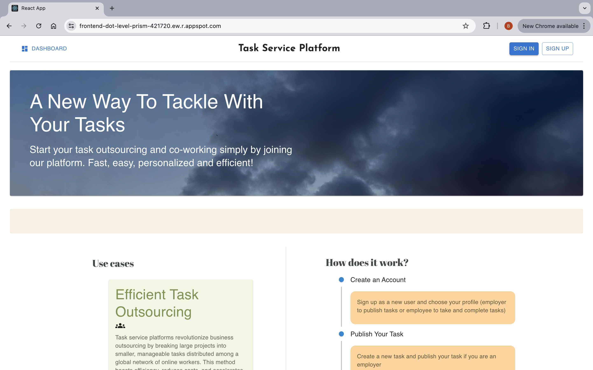

## Description

An interactive role-based web platform for users to outsource, take and manage tasks. Users who registered as an employee will also received personalized task recommendations.

## Deployment

This app is deployed on Google Cloud

## User Instruction

[User manual](https://github.com/carrottoo/task_platform/blob/main/doc/User%20Manual.pdf)

## Examples

Homepage (staging)



WebGL background created with THREE

https://github.com/user-attachments/assets/d1c417bd-42f4-47f5-93dd-421bc2c88ba2

#### Demos for users whose chosen role is 'employer'

Sign in 

https://github.com/user-attachments/assets/4eff8729-1055-41c8-b8c6-790d46a91b6c

Explore the dashboard and create a task property tag

https://github.com/user-attachments/assets/002aff0d-2efc-48ae-804a-98ebc126fab0

Create a task

https://github.com/user-attachments/assets/24f16078-226f-4a55-a7b3-c4e4ba6d50c2

Delete a task

https://github.com/user-attachments/assets/5a64c0c8-1625-4abd-8035-127a67365a0c

Delete a tag

https://github.com/user-attachments/assets/7b1d3e1d-7046-4edd-91e3-da2a4165d765

Sort the table 

https://github.com/user-attachments/assets/24290178-3d3d-4148-b27c-c124c0f242a7

Sign out 

https://github.com/user-attachments/assets/f4866639-4758-47fb-818a-e3a1a5d0b662

#### Demos for users whose chosen role is 'employee'

Explore the dashboard with personalized task recommendation 

https://github.com/user-attachments/assets/bb104a45-b698-43d6-a606-d0a4374f1ddb

Add a task property tag to or remove it from your interested tag list 

https://github.com/user-attachments/assets/47379be4-d74b-4e0a-bdf6-f5668df02ded

Add a task to or remove it your liked task list 

https://github.com/user-attachments/assets/5d869c3a-e154-4dfd-a13c-c28f46cff239

Assign and unassign yourself from a task 

https://github.com/user-attachments/assets/8165d7a2-ecbc-45e1-9b12-ae3f0015862d

https://github.com/user-attachments/assets/9a1d7ead-b3a0-4c64-871d-9de0ed1f8f28

Submit a task for review

https://github.com/user-attachments/assets/b781d8a6-93e7-4f81-88f9-f508d8cf0258


There are much more functionalities you can explore, if you are interested follow the instructions to try it yourself!

## Try yourself

### To run in dev

```
npm start
```
or if you want to use the backend service in dev mode
```
npm run start-dev
```
### To run in production

```
npm run build , npx serve -s build
```

### To run test

```
npm test
```
